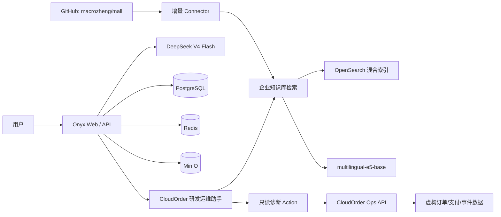

# 企业级 RAG 与只读运维 Agent 平台

这是一个基于 Onyx 二次开发的企业级 LLM 应用工程项目。项目将中文企业知识库、真实 GitHub 研发数据、RAG 评测、幻觉治理和受控工具调用整合为一套可部署、可量化、可审计的系统。

> 项目定位：大模型应用 / RAG / Agent / AI 后端 / LLMOps。  
> 不宣称训练了基础大模型，也不宣称独立开发了 Onyx。

## 系统架构

## 已实现能力

- 腾讯云 Ubuntu 服务器上的 Onyx v4.2.2 Standard 多容器部署。
- DeepSeek V4 Flash 模型接入。
- 30 份带版本、状态与安全分类的中文企业文档。
- 50 道黄金问题检索评测集和 10 道高风险生成评测集。
- 文档引用、无答案拒答、冲突版本处理和敏感数据边界。
- Nomic 与 Multilingual E5 Embedding A/B 对比。
- 自研只读运维 API，通过 OpenAPI Action 接入 Agent。
- API Key 鉴权、结构化审计日志、限流、健康检查、非 root 容器和只读文件系统。
- Agent 调用顺序：先检索 Runbook，再调用只读诊断工具，最后分离政策依据与运行时事实。
- 接入 `macrozheng/mall` 真实 GitHub 仓库，摄取 674 条文档/Issue/PR、形成 900 个检索分块，并设置 6 小时增量同步。
- 建立与 CloudOrder 隔离的 Mall 文档集和专用研发 Agent，避免模拟企业数据与真实开源数据相互污染。
- 针对真实仓库建立 20 道黄金问题，覆盖架构、部署、Issue、PR、多来源推理、隐私与凭据拒答。
- 服务器健康检查、PostgreSQL 逻辑备份和临时数据库恢复演练。
- 建立可复现的 Retrieval/Agent 并发压测脚本，并在请求期间采集宿主机与容器资源峰值。
- 配置 GitHub Actions CI/CD：自动单元测试、70 题数据校验、凭据扫描、容器构建/健康检查，以及带人工审批、健康门禁和旧镜像回滚的 Ops API 部署流程。

## 当前指标

| 指标 | 结果 |
|---|---:|
| 检索请求成功率 | 100% |
| Hit@5 | 100% |
| MRR | 0.866 |
| 检索中位延迟 | 0.319 秒 |
| 检索 P95 | 0.783 秒 |
| 高风险题来源命中率 | 100% |
| 引用存在率 | 100% |
| 无答案拒答通过率 | 100% |
| GitHub 首次摄取 | 674 条 / 900 chunks |
| GitHub 评测预期来源命中率 | 100% |
| GitHub 可回答问题引用率 | 100% |
| GitHub 拒答通过率 | 100% |
| GitHub 生成延迟中位数 / P95 | 14.87 秒 / 22.71 秒 |
| 检索 32 并发成功率 / P95 | 100% / 0.94 秒 |
| Agent 6 并发突发成功率 / P95 | 100% / 15.44 秒 |

详细证据位于 [评测结果](./enterprise-rag-dataset/evaluation/results/)；Embedding 对比见 [A/B 报告](./enterprise-rag-dataset/evaluation/results/embedding_ab_comparison_20260702.md)，真实 GitHub 数据评测见 [Mall 最终报告](./enterprise-rag-dataset/evaluation/results/mall/final/baseline_20260703_092434.md)，并发容量与瓶颈分析见 [压力测试报告](./docs/PERFORMANCE_REPORT.md)。

## 关键工程案例

### 1. Prompt 幻觉修复

初始 Agent 曾在未检索时虚构 PCI-DSS 和 Token 化资料。通过增加“事实问题强制检索、无来源拒答”规则，修复后来源命中和引用恢复，停止虚构文档与认证。

### 2. Embedding 迁移故障

新索引任务虽然显示成功，但实际写入 0 chunk。通过检查数据库任务字段发现文件连接器复用了增量检查点；原位替换文件 ID 后重新摄取，最终成功写入 30 个 chunk。

### 3. Agent 工具安全收敛

最初向模型暴露多个底层诊断接口，模型会自行组合并增加额外推断。随后只暴露规则约束后的 `diagnoseOrder` 聚合接口，同时保留底层接口供人工排查，降低错误建议风险。

## 代码结构

- `enterprise-rag-dataset/`：企业知识库、黄金问题和评测脚本。
- `cloudorder-ops-api/`：自研只读诊断 API 与容器部署文件。
- `onyx_offline_override.yml`：国内网络环境下的离线模型配置。
- `.github/workflows/`：CI 与手动审批 CD 流水线。
- `scripts/`：项目校验、本机 CI 和安全部署/回滚脚本。

## 安全说明

- 仓库不保存 PAT、模型 API Key、SSH 私钥或运维 API Key。
- CloudOrder 业务数据均为虚构数据；真实数据源仅使用公开 GitHub 仓库内容。
- Agent Action 只提供 GET 查询，不提供生产写操作。
- 高风险补偿仍需审批、双人复核与审计，不能由 Agent 自动执行。

## 后续路线

1. 增加 Prometheus/Grafana 指标、日志告警和腾讯云 COS 异地备份。
2. 配置域名、HTTPS、限流和公网访问收敛。
3. 创建远程 GitHub 仓库并启用 Branch Protection、`production` Environment 审批和 Actions Secrets。
4. 完成模型冷启动预热、演示视频和真实 GitHub 数据源的面试讲解材料。
